# Process Flow

## Transaction Types

* Broadly there can be 3 types of procurement - 
* **Goods**
  * It means tangible goods like raw material
* **Service**
  * If we are hiring or procuring any services like professional services, car hire or tranportation services we can classify them as under service
* **Works**
  * It is normally combination of goods and services e.g. Repair, maintenance contract or painting of factory. We are actually procuring service and goods both - combination of them

* Depending upon intention behind why we are procuring, the accouting treatment will be decided
* So ,
  * Goods/Services/Works are - **Operational Expenses**
  * Capex or Capital Expenditure - Example computer, machinery, laptop etc.

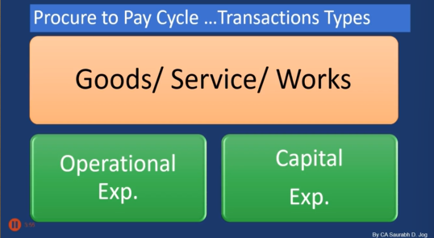

> So depending upon the nature of transaction, the account method will obviously change and there might be differences in statutory provisions in respect of input, tax credit etc  

## Another classification

* This classification has only one difference that is of documentation
  * Rules and regulations regarding input tax credit or applicability of tax deduction at source obviously will differ.

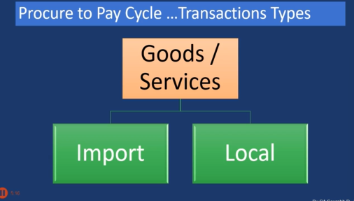

## Procure to Pay cycle

* The Procure-to-Pay cycle is a system of checks and balances that ensures a company only pays for goods or services that were genuinely needed, properly authorized, correctly received, and accurately billed.

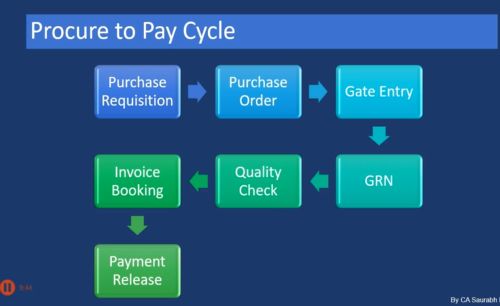

1. **Purchase Requisition** - It is a request for purchase of some goods. We will get different quotations fromt the market. 

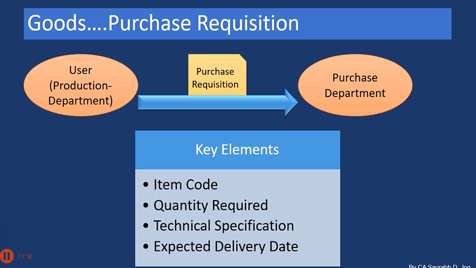

e.g. Sample Format

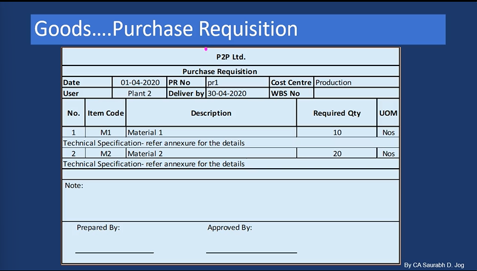

WBS - Work breakdown schedule  
UOM - Unit of measurement  
PR No - Purchase requisition number  
Cost centre - To identify cost to a particular department, location or identifiable business unit  

Org. to Org the fields will vary  

Approved by - It can be based upon org authorization matrix  

## Finance Controlling

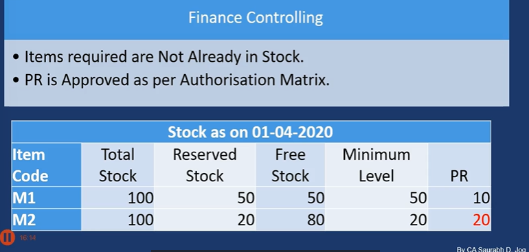

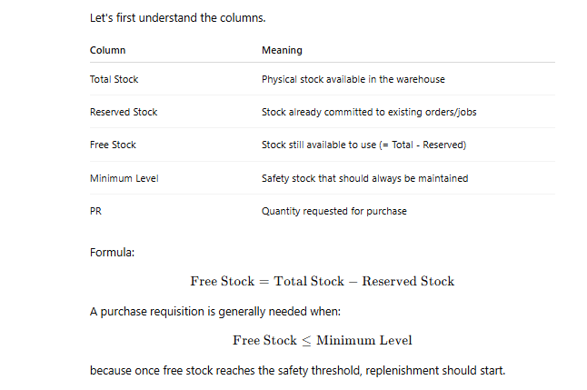

### Authorization

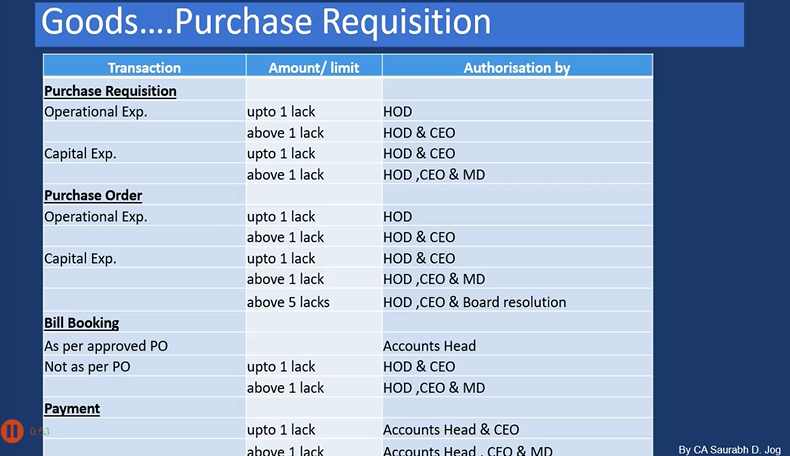

## 2. Purchase Order

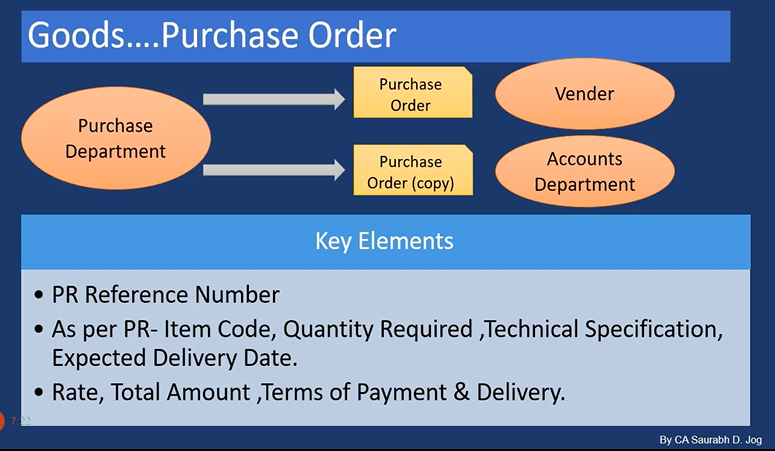

Purchase order format -  

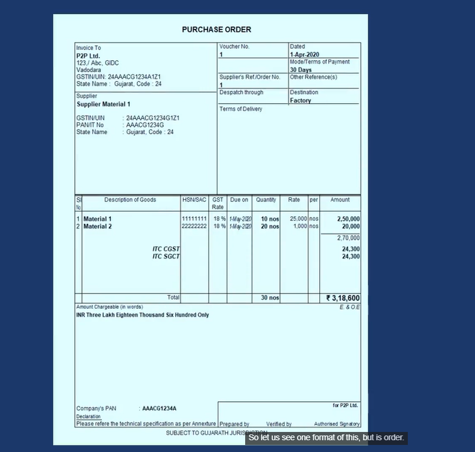

* Finance Controlling

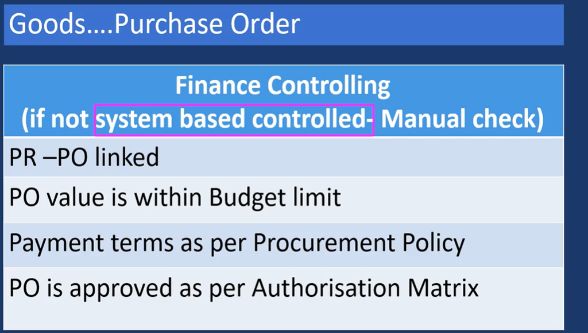

* Preventive control is far more better than a detective control

## 3. GOODS GRN

* **Before dispatch of Goods**
  * Vendor send Advance Shipping Note / Pro forma Invoice.
  * Purchase Dept. verifies details & then vendor
dispatched goods with Tax invoice.

> Just rectivy this and then send

### Goods Gate Entry Note

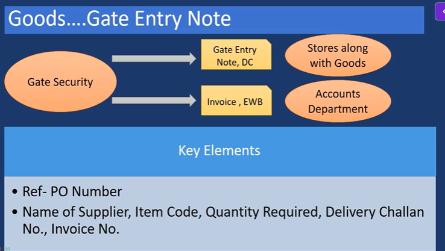

* Storage department get only goods and along with goods delivery challan
  * Some org strictly follow the rule that this security person should not have the access to the invoice or the rate and amount details of the goods. So you should only deal only with delivery challans

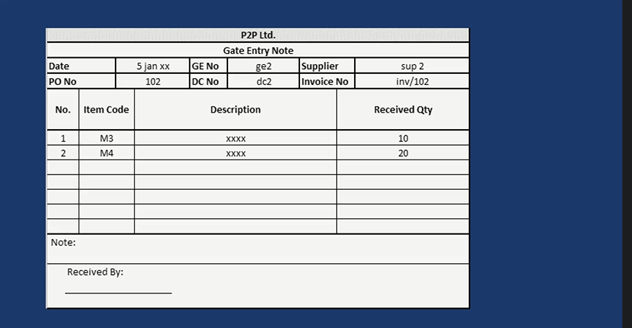

Org can also maintain in excel format also like this  

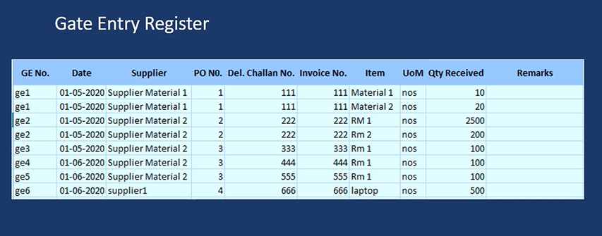

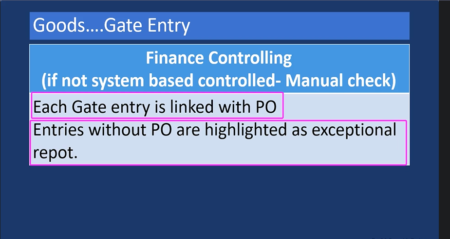

* There can be cases where we have received gods but there is no PO(purchase requisition) number

* Stores will intimate QC(quality check) department

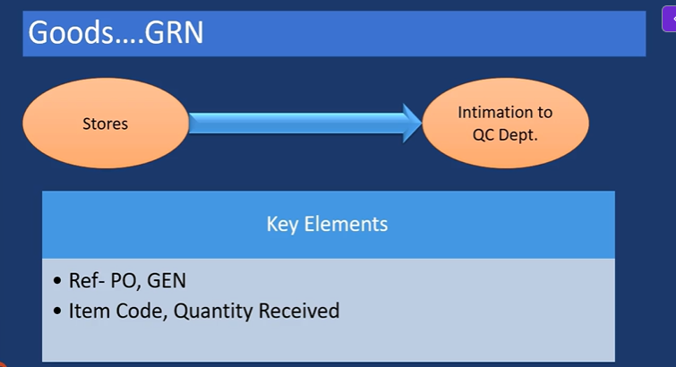

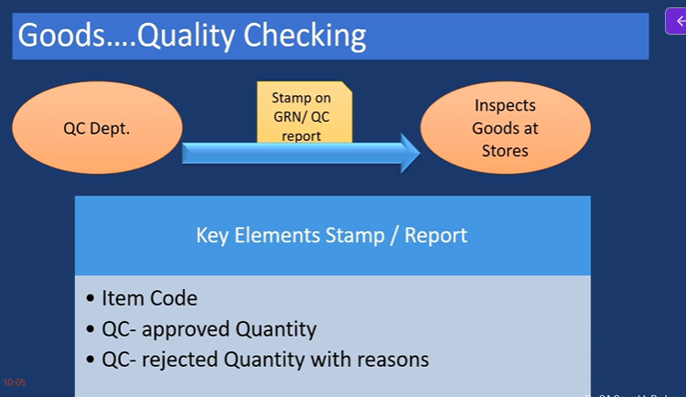

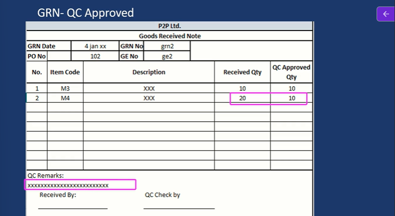

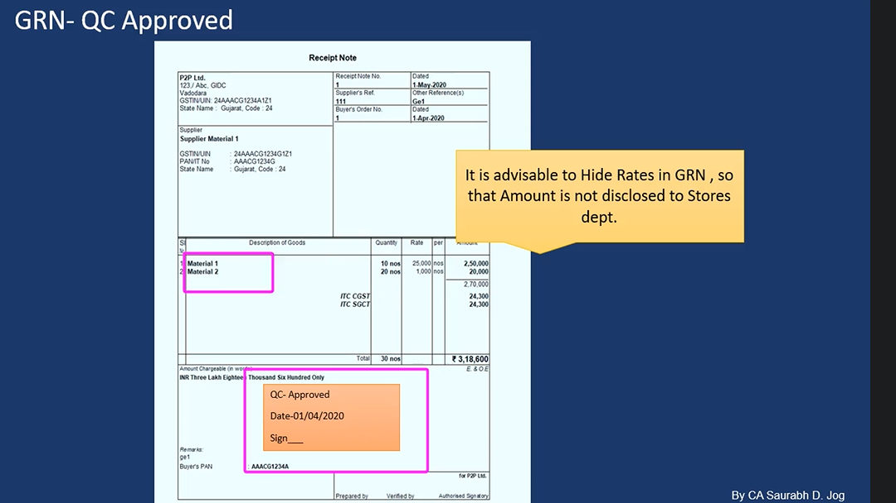

* It is advisable to hide the rate and amount so that it is not visible to storage and QC department

* Goods...GRN...Rejected by QC

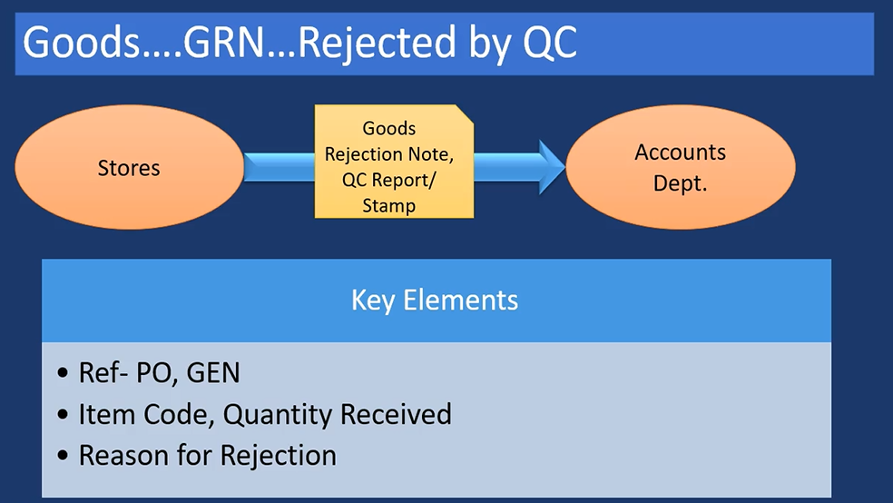

after rejection it will be transferred to account department

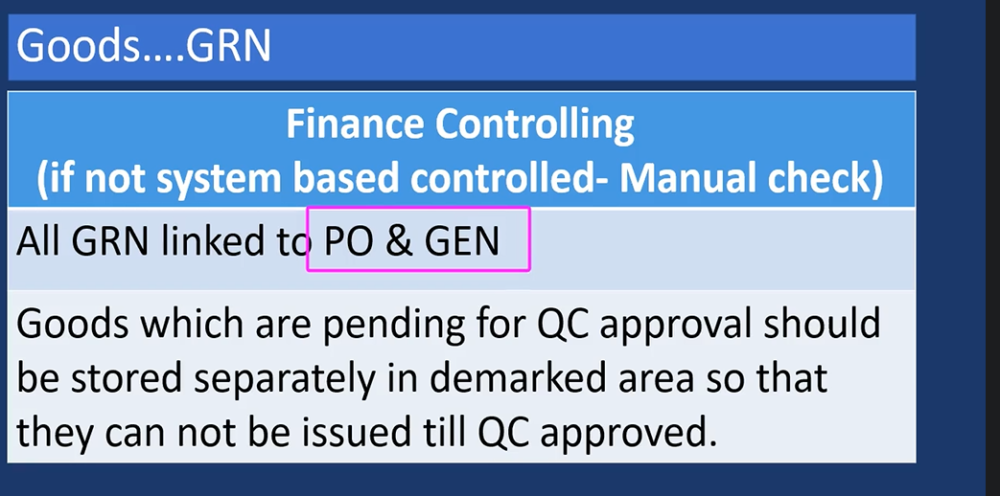

every Goods receipt note must have Gate entry note

## Goods... Bill Booking

* These documents should be given to accounts department

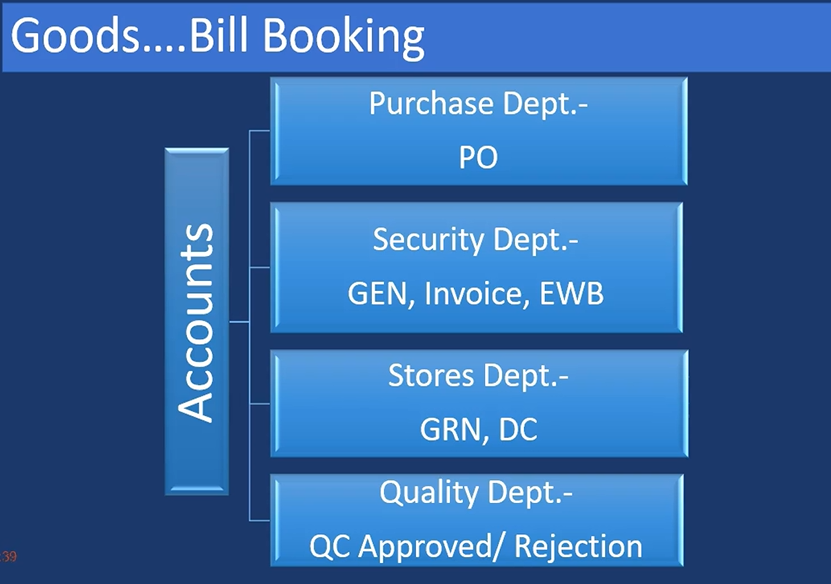

> So now accounts department will have either all these documents in physical form or in electronic form in ERP system. So like PO, PO may not be transferred to purchase from purchase department physically. In case of say SAP or Oracle ERP systems these are available in the system only. So that is why either it can be in physical form or electronic form. Oualitu Dont

* Goods - Invoice

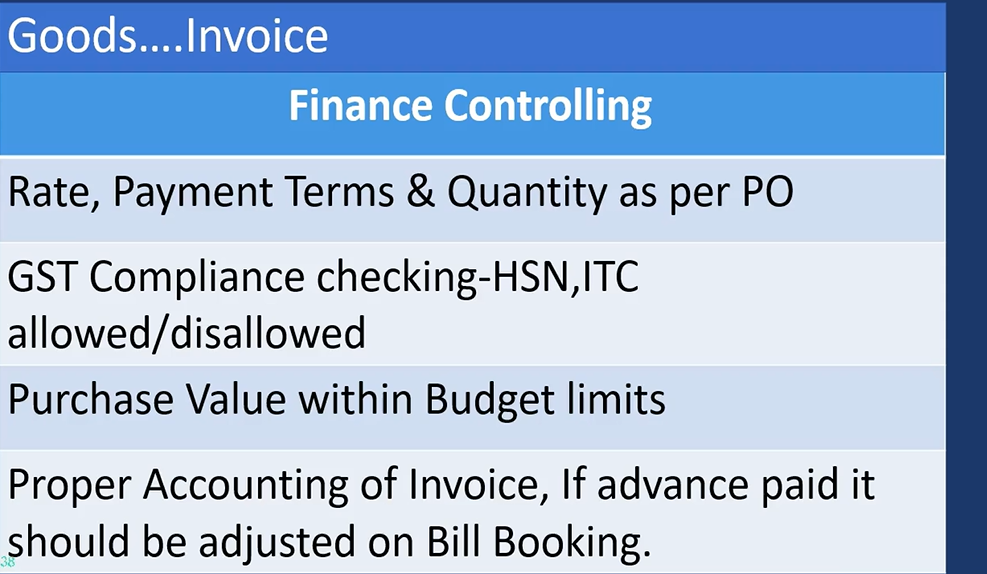